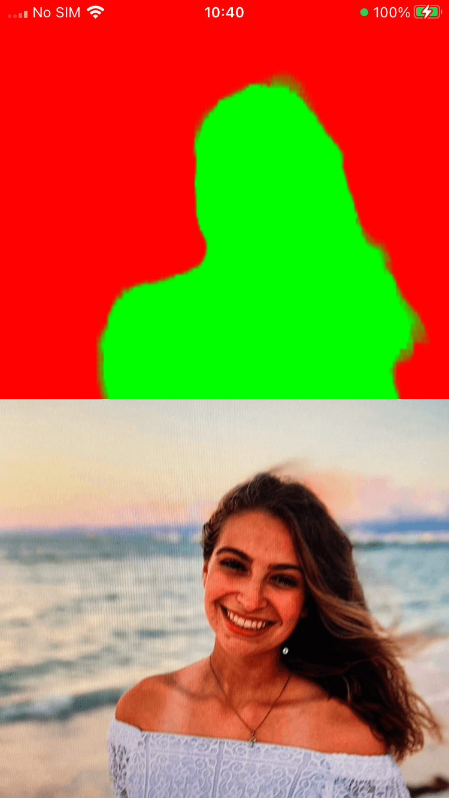

<div align="right">

</div>

# react-native-vision-camera-selfie-segmentation

A [VisionCamera](https://github.com/mrousavy/react-native-vision-camera) Frame Processor Plugin to mask selfies
using [**MLKit Vision** Selfie Segmentation](https://developers.google.com/ml-kit/vision/selfie-segmentation).

**Notice**: This repo was made as a proof of concept. If you're looking to use the MLKit Selfie Segmentation on a live camera view,
it doesn't appear possible with Vision Camera right now, but feel free to give it a go.

It's probably much easier to use the Selfie Segmentation on static images only.

## Installation

```sh
npm install react-native-vision-camera-selfie-segmentation
cd ios && pod install
```

Add the plugin to your `babel.config.js`:

```js
module.exports = {
  plugins: [
    [
      'react-native-reanimated/plugin',
      {
        globals: ['__getSelfieSegments'],
      },
    ],
    // ...
```

> Note: You have to restart metro-bundler for changes in the `babel.config.js` file to take effect.

## Usage

```js
import { getSelfieSegments } from 'react-native-vision-camera-selfie-segmentation';

// ...

const frameProcessor = useFrameProcessor((frame) => {
  'worklet';
  const base64Image = getSelfieSegments(frame, '#FF0000', '#00FF00');
}, []);
```

## Props

| Prop            | Type    | Default | Definition                                                                                                                                                     |
|-----------------|---------|--------|----------------------------------------------------------------------------------------------------------------------------------------------------------------|
| frame           | Frame   | frame  | Required - The frame as passed by the useFrameProcessor hook                                                                                                   |
| backgroundColor | string  | `#000000` | Required - The background colour of the background pixels of the image                                                                                         |
| foregroundColor | string? | `null` | Optional - The foreground color of the image, used for the selfie pixels of the image. If none is passed, the original image will be used, showing the person. |

## Response

| Response     | Type   | Default | Definition                                                                                      |
|--------------|--------|-------|-------------------------------------------------------------------------------------------------|
| Base64 Image | String | ""  | A base 64 image, containing "data:image/jpeg;base64," and relevant base64 data of the new image |

## Example

```js
const [image, setImage] = useState<string>('');

const updateImage = (newImage: string) => {
  setImage(newImage);
};

const frameProcessor = useFrameProcessor((frame) => {
'worklet';
  const image = getSelfieSegments(frame, '#FFF000');
  runOnJS(updateImage)(image);
}, []);

return (
  <>
    {image !== '' && <Image source={{uri: image}} />}
  </>
)
```
## Known Issues

1. Originally, I wanted to pass the selfie segments data back to the frame to mask the original camera. However, this didn't seem possible, but maybe in future.
2. Performance - Due to the intensive amount of work required to get the selfie segmentation data, you'll be lucky to get 2-3 FPS. Though, this is mainly due to my lack of knowledge in Swift/Java, so can probably be improved.
3. Android - There's a flash between images as it's updated in state.

## Contributing

See the [contributing guide](CONTRIBUTING.md) to learn how to contribute to the repository and the development workflow.

## License

MIT
